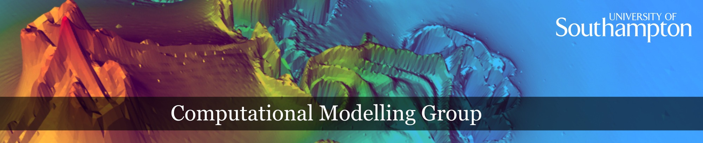

Computational Modelling Group (CMG)
===================================

.. toctree::
   :hidden:
   :maxdepth: 1

   about

Welcome to the home page of the Computational Modelling Group at the `University
of Southampton <https://www.southampton.ac.uk>`__.The Web pages of the CMG from
2009 to 2024 have been archived at `https://cmg.soton.ac.uk
<https://cmg.soton.ac.uk>`__.

Support and consultancy
-----------------------

For support and consultancy for Computational Modelling, High Performance
Computing and Research Software Engineering, the following support structures
and points of contact are available:

- `High Performance Computing <https://www.southampton.ac.uk/isolutions/staff/high-performance-computing.page>`__,
  including includes access to and usage of the University of Southampton's high performance
  computing facilities.

- `Southampton Research Software Group <https://rsgsoton.net/>`__ for research
  software engineering (RSE) advice and support at the University of
  Southampton. This includes planning of grant proposals that have a
  computational or data component and would like to include staff time from RSE
  experts.

- For other queries, including consultancy requests from outside the university,
  contact `Hans Fangohr by email <mailto:cmg@soton.ac.uk>`__.

- For communication within the group, a
  `mailing list <https://lists.soton.ac.uk/info/computational-modelling-group>`__ is in
  preparation.

About
-----

Please see `here <about.html>`__ for details about the Computational Modelling
activities at Southampton and the historical context.

-----

Last updated: 2024-04-07
